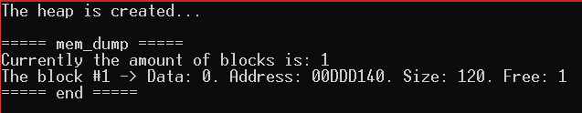
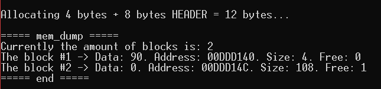
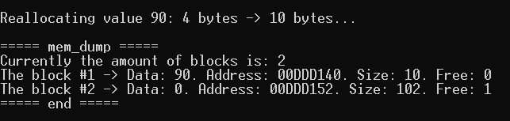
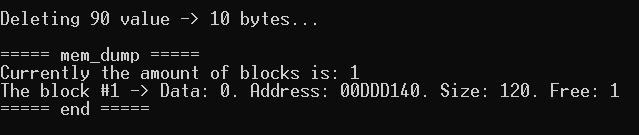

# Memory_Allocator_Simulator
## DESCRIPTION
### Brief description
A test of implementing the basic work mechanic of memory allocators (not actually implementing the allocator).  
The algorithm suggests we have a continuous part of memory. There, we can allocate different **blocks**. The function uses the pointer arithmetic to move between the blocks.

Each block has a **header** and the **data**. **Header** always has a fixed size of 8 bytes.   
That means, to allocate ***10 bytes*** of memory, we need at least ***18 bytes*** of free memory.
The structure of **header**:   
> **[current block size : 2 bytes | previous block size : 2 bytes | data is occupied : 1 byte | placeholder : 3 bytes]**
### Algorithm description   
#### `void* mem_alloc(size_t size)` function
When the `mem_alloc` function is called,
it searches for the smallest block of free memory, satisfying the `size` criteria (the size of that free block has to be at least `size + HEADER_SIZE`).
If it found such - it splits the block into the 'taken for allocation memory' block and the 'free memory left' block.
If it didn't - it returns the `nullptr`.
#### `void* mem_realloc(void* addr, size_t size)` function
This function call first of all decides, if it has to make the block smaller or bigger.   

**If the block is going to become smaller**, the current memory block will be splitted into two: the 'new data' block and the 'freed memory' block.
Then the `mem_free` function is called ('freed memory' block pointer is passed there as an argument).    
    
**If the block is going to become bigger**, first of all, it is analyzed, if the memory block can "overflow" to the adjacent block of free memory
 (if they exist). If it's not possible, the `mem_alloc` function is called to find the free memory block with enough free memory and the data is copied
to the new block. The old block data is deleted, the `mem_free` is called with the old block data pointer passed as the argument.
#### `void mem_free(void* addr)` function
The function deletes the data of the block, flags it as the 'free memory' block and tries to merge with adjacent 'free memory' blocks, if present.
## HOW TO USE
To use the algorithm, open the file in any IDE with C++ support or use the [C++ shell website to compile the code](http://cpp.sh/).   
Describe your use cases in `main()` function or implement it in separate function, then calling it in `main()` function.

## DEMONSTRATION

> All memory state outputs are made with the `mem_dump` function, which, basically, goes through 'our' heap and prints the states of all the existing blocks. 

#### The creation of the 'default' sized 'heap' with 128 bytes of memory (8 bytes are immediately taken for the header)
##### Code
```  
MemoryAllocator allocator;     
   
allocator.mem_dump();    
```
##### Output

#### The allocation of the `int` sized block of memory with further initialization of it.
##### Code
```
int* test1;
test1 = (int*)allocator.mem_alloc(sizeof(int));    
*test1 = 90;    
   
allocator.mem_dump();    
```
##### Output

#### The reallocation of the previously created block of memory to size 10.
##### Code
```
test1 = (int*)allocator.mem_realloc(test1, 10);    
   
allocator.mem_dump();    
```
##### Output

#### The `mem_free` call for the previously created block of memory.
##### Code
```
allocator.mem_free(test1);    
   
allocator.mem_dump();    
```
##### Output

